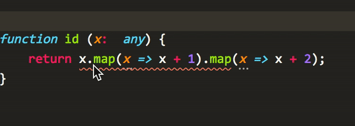

# Algebra Linter

Pushing the limits of typescript by defining formalisms.
As an example, javascript Array.map is a functor which obeys the functor law

[Functor](https://en.wikipedia.org/wiki/Functor)

This formalism is used to prevent user from writing code like below

Feel free to fork / contribute to the repository with even more formalisms.

Incase you have a suggestion, feel free to raise it as an issue here, and we'll add the algebra to the linter.
